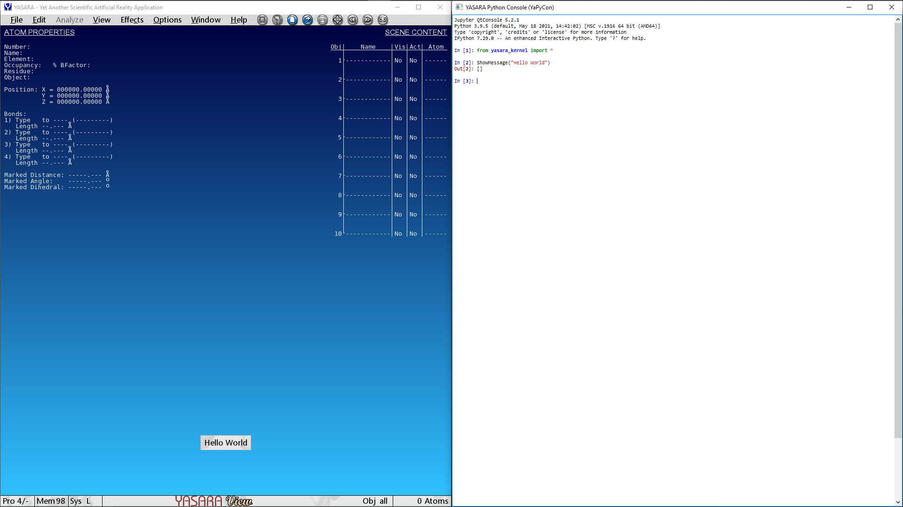

.. _detailed_examples:

=================
Detailed examples
=================

``Hello World``: YASARA Edition
-------------------------------

This is perhaps the simplest way to interact with YASARA and get it to display a simple message.
This can be achieved as follows:

::

    > from yasara_kernel import *
    > ShowMessage("Hello World")

Information available to plugins
--------------------------------

Plugins can access :ref:`a number of predefined variables <_plugin_predef>` that are made available to them from
the main program and all of them can be accessed from the console.

For example, go ahead and check the ``owner`` information that is hard-coded in the software for you. In my case,
these were:

::

    In [3]: owner.familyname
    Out[3]: 'Anastasiou'

    In [4]: owner.firstname
    Out[4]: 'Athanasios'

For another example, let's check what "stage" our YASARA is at. The "stage" defines the availability of certain
functionality to YASARA. The *"View"* stage is the entry level with all of its functionality provided for free.

::

    In [1]: stage
    Out[1]: `View`