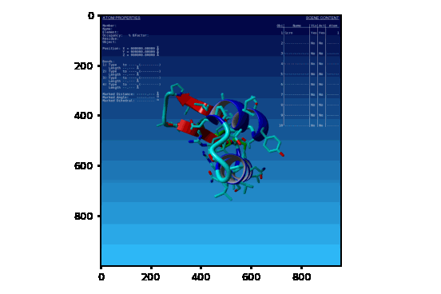

.. _detailed_examples:

========
Examples
========

``Hello World``: YaPyCon Edition
================================

This is perhaps the simplest way to interact with YASARA and get it to display a simple message.
This can be achieved as follows:

.. literalinclude:: resources/code_examples/yapycon_hello_world.py

.. thumbnail:: resources/figures/fig_hello_world.png

Accessing YASARA's pre-defined variables for plugins
====================================================

Plugins can access :ref:`a number of predefined variables <_plugin_predef>` that are made available to them from
the main program and all of them can be accessed from the console.

For example, go ahead and check the ``owner`` information that is hard-coded in the software for you. In my case,
these were:

::

    In [3]: owner.familyname
    Out[3]: 'Anastasiou'

    In [4]: owner.firstname
    Out[4]: 'Athanasios'

For another example, let's check what "stage" our YASARA installation is at. The "stage" defines the availability of
certain functionality to YASARA. The *"View"* stage is the entry level with all of its functionality provided for free.

::

    In [1]: stage
    Out[1]: `View`

Obtaining a screenshot
======================
YASARA offers a number of ways by which screenshots can be produced from within the program itself ranging from a
straightforward screenshot of the current state of the user interface, to high resolution renderings
(via `POV-Ray <https://www.povray.org/>`_), to 3D formats such as point clouds,
`Wavefront <https://en.wikipedia.org/wiki/Wavefront_.obj_file>`_ objects and STL files for 3D printing.

This example is about the entry level capability of simply saving a screenshot and it also demonstrates some
additional functionality due to ``YaPyCon``.

In the following script, it is assumed that you have started YASARA and went directly into the console. Notice that the
script already loads a sample molecule (``"1CRN"``) to work with but if you already have something loaded in YASARA,
feel free to skip that part.

.. literalinclude:: resources/code_examples/yapycon_take_screenshot.py

If everything has gone well, you are probably looking at something like this:

.. thumbnail:: resources/figures/fig_example_savepng.png

It is worth noting at this point that *SavePNG* works differently than the standard ``yasara`` module, ``SavePNG``
function. Normally, ``SavePNG()`` would return the result of the command, but when you load ``yasara_kernel``, the
same command will return a numpy array with the screenshot that was just saved from YASARA (**if matplotlib is available
in the currently active Python environment**).

This small modification, combined with the "magic" command ``%matplotlib inline`` enable the Python console to
display the image very conveniently within the console itself.

Creating animated GIFs
----------------------
This is a plain simple re-creation of the built in demo of creating an animated GIF, but executed entirely in
``YaPyCon`` and standard Python.

.. literalinclude:: resources/code_examples/yapycon_animated_gif.py

This script will produce the following animated gif:

Exporting data in different formats
===================================
When YASARA loads a molecule from one of the standard file formats, it performs a few standard sanity checks [#]_ on
the data about the atoms and (more importantly) the bonds of that molecule.

Fortunately, all of this information is available to plugin developers.

``YaPyCon`` extends the existing functionality with some convenience functions that reshape the way information is
returned from YASARA and enable a much faster lookup.

In this example, one of the smallest molecules available in the PDB (``1GCN``) is loaded in YASARA and converted to
a graph.

A graph (:math:`G`) is a mathematical object composed of a set of nodes (:math:`V`) connected via edges (:math:`E`). In
the context of bio-informatics the nodes of the graph representation of a molecule correspond to the molecule's atoms
and the edges correspond to the molecule's bonds.

Graph representations are very useful in a number of different applications but in this example we are simply creating
a graph and visualising it.

.. note ::
    The following code, requires the module ``networkx`` to be installed in the activated Python environment.

    ``networkx`` can be installed from PyPi via a simple: ``pip install networkx``.

.. literalinclude:: resources/code_examples/yapycon_export_graphml.py

This code snippet saves the network in the file ``yasara_molecule.graphml`` in the user's home directory
(``C:\Users\<username>`` in MS Windows, ``/home/<username>`` in Linux) and also uses the Kamada-Kawai force
directed algorithm to provide a simple rendering of the network data.

In this rendering (available below), each node is labeled with the atom's element:

.. thumbnail:: resources/figures/fig_example_net_rend.png

It is worth noting here that the above graph representation includes **only the covalent bonds** of a molecule.

YASARA *does* provide functions to "list" (i.e, to retrieve information about) "bonds" and interactions of different
types (e.g. hydrogen bonds, hydrophobic interactions, pi-pi interactions and others) that contribute to the tertiary
structure of a given molecule but this functionality is *not available at the YASARA View stage*.

.. [#] Sanity checks are applied at different levels and "stages". The entry level stage, YASARA View, preforms 4
       standard checks as part of the ``LoadPDB`` command but the ``Clean`` command of the YASARA Model stage, performs
       39 checks to counteract a variety of known data quality issues.