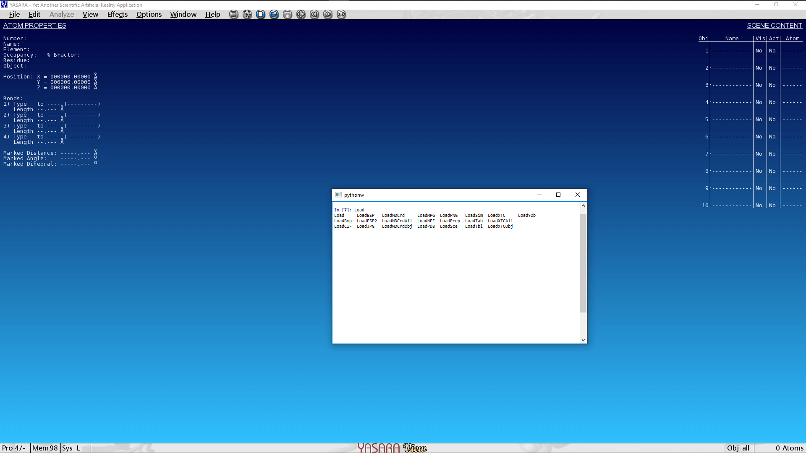
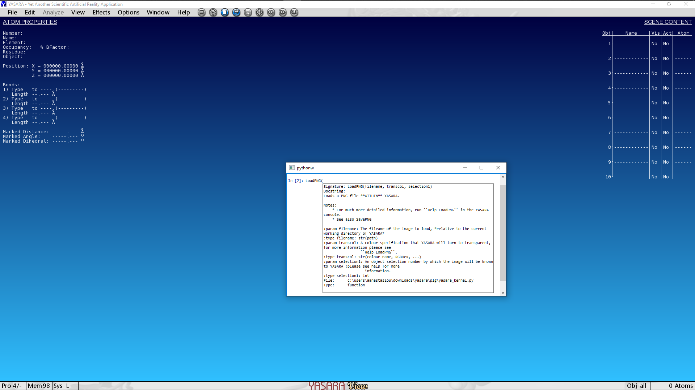

============================
Launching the Python console
============================

Assuming an uneventful :ref:`installation process <install_quickstart>`, you can now launch ``YaPyCon``. This is
identical to an IPython session, providing a Python language shell which executes Python directly.

This console however has minor knowledge of the fact that it was launched as a YASARA plugin. You can still
execute arbitrary Python code in it (e.g. ``3+2``) but you cannot interact with YASARA...yet.

To achieve this, you should first import the ``yasara_kernel.py`` module. This is usually the first thing to import
with a simple:

::

    In [1]: import yasara_kernel

Or, if you do not want to prefix every command with ``yasara_kernel.``, import as:

::

    In [1]: from yasara_kernel import *

After importing the **yasara_kernel** module, the Python console now becomes a real-time "window" to YASARA's
functionality,  with all the useful features expected, such as auto-completion of commands, inline help and others.

For example, to see all the different functions by which a plugin can load information into YASARA, simply type
"Load" and press Tab:

Inline help is provided about each command as you type, for example, typing ``LoadPNG(...`` brings up the docstring
of the function.

.. note::
    ``yasara_kernel.py`` provides just enough information in the function docstrings to provide reminders to a
    function's use and its parameters.

    This *does not aim to substitute YASARA's documentation*.

    YASARA's documentation provides much more information about a command, often relating it to a specific
    scientific usage as well.

    YASARA's documentation system is accessible from within YASARA by pressing Space (to bring up the YASARA console)
    and then typing ``Help `` followed by a particular command. (e.g. ``Help LoadPNG``).

The console appears like any other application window, so, to close it, simply click on the ``X`` at the top right-hand
side of the window or type ``exit``, just as you would in any shell.

Just be mindfull that if you have the in-software console open as well, the Python console might appear to "hang".
This is a known behaviour and before you start killing processes, make sure that you have closed the in-program
console.

.. Accessing the Jupyter Kernel
.. ============================
..
.. When you start the Python console, you are actually starting a Jupyter kernel and connect to it too. This kernel
.. is exposed to the system and it can be accessible via a Jupyter notebook too, which makes for some very useful ways
.. of interacting with YASARA.
..
.. To connect your Jupyter notebook to a running instance of YASARA:
..
.. 1. Launch YASARA
.. 2. Launch the console
.. 3. Launch a Jupyter notebook on the same computer
.. 4. Try to connect to an existing kernel
.. 5. Choose the one that is suggested by the notebook.
.. 6. You are now connected to the same kernel (and its context) via the jupyter notebook.
