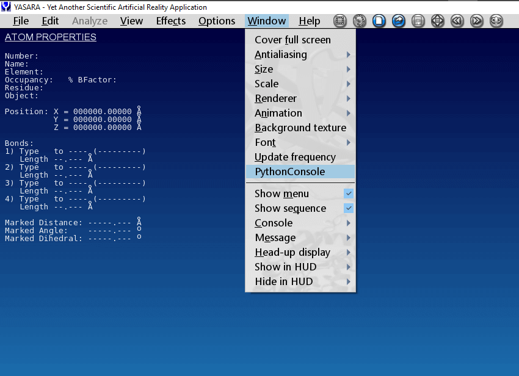

=============
Using YaPyCon
=============

Launching the console
=====================

Assuming an uneventful :ref:`installation process <install_quickstart>`, you can now launch ``YaPyCon`` by selecting
"Python Console" from YASARA's top level "Window" menu option.

This console is identical to an IPython session, providing a Python language shell which executes Python directly.
This console however has minor knowledge of the fact that it was launched as a YASARA plugin. You can still
execute arbitrary Python code in it (e.g. ``3+2``) but you cannot interact with YASARA until you have imported the
``yasara_kernel`` module (please see :ref:`func_typical_use`).

When "Python Console" is not available
======================================

The main reason for YaPyCon to not show up as an option under "Window" within YASARA is to fail to load one of its
dependencies.

This can happen because of two reasons:

1. A suitable Python virtual environment was not activated prior to starting YASARA.

2. A Python virtual environment was activated but it did not contain YaPyCon's requirements. That is,
   ``PyQt5, rpyc, qtconsole`` and ``IPython``.

Terminating the console
=======================

The console appears like any other application window, so, to close it, simply click on the ``X`` at the top right-hand
side of the window *or* type ``exit``, just as you would in any shell.

.. _func_typical_use:

Typical use of the console
==========================

Once the console is launched, it can perform any kind of computation a typical Python console would but it is not yet
"linked" with the YASARA instance that launched it. To do that, you should first import the ``yasara_kernel.py`` module.

This is usually the first thing to import in the console window, with a simple:

::

    In [1]: import yasara_kernel

Or, if you do not want to prefix every command with ``yasara_kernel.``, import as:

::

    In [1]: from yasara_kernel import *

After importing the **yasara_kernel** module, the Python console now becomes a real-time "window" to YASARA's
functionality,  with all the useful features expected, such as auto-completion of commands, inline help and others.

For example, to see all the different functions by which a plugin can load information into YASARA, simply type
"Load" and press Tab:

.. thumbnail:: resources/figures/fig_tab_comp.png

Inline help is provided about each command as you type, for example, typing ``LoadPNG(...`` brings up the docstring
of the function.

.. thumbnail:: resources/figures/fig_inline_help.png

.. note::
    ``yasara_kernel.py`` provides just enough information in *some* function docstrings to provide reminders for a
    function's use and its parameters.

    This *does not aim to substitute YASARA's documentation*.

    YASARA's documentation provides much more information about a command, often relating it to a specific
    scientific usage as well.

    YASARA's documentation system is accessible from within YASARA by pressing Space (to bring up the Yanaconda console)
    and then typing ``Help`` followed by a particular command. (e.g. ``Help LoadPNG``).

Caveats
=======

1. If the Yanaconda console is open *prior to making a function call* from YaPyCon, it might
   appear to "hang", as depicted in the following screenshot:

   .. thumbnail:: resources/figures/fig_yapycon_yanaconda_console_open.png

   This is a known behaviour and before attempting to restart any process, please make sure that you have closed the
   in-program console. Even if the plugin appears to "hang" momentarily, it will still go ahead once the Yanaconda
   console is closed.

2. If the program remains in this "indeterminate" state for too long (>20 seconds), an error message similar to
   the one depicted below will be produced. If that occurs, simply close the console and restart it.

   .. thumbnail:: resources/figures/fig_plugin_timeout.png

