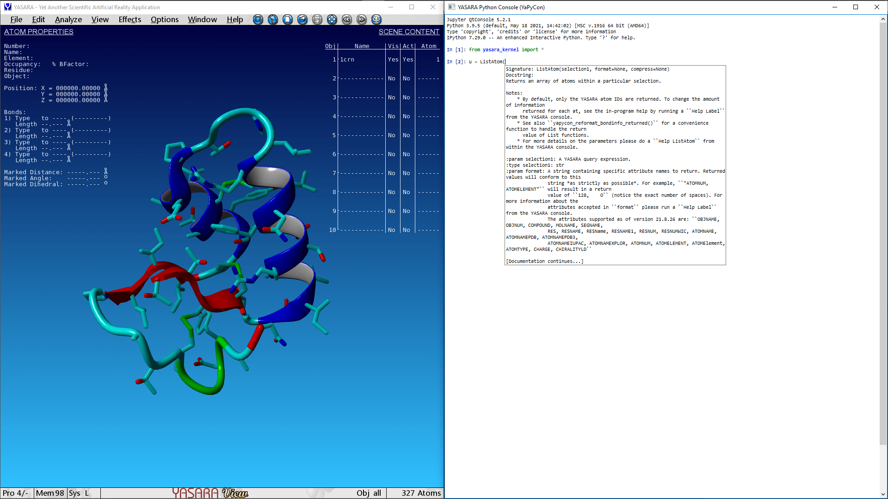

.. YaPyCon documentation master file, created by
   sphinx-quickstart on Tue Nov 30 10:09:21 2021.
   You can adapt this file completely to your liking, but it should at least
   contain the root `toctree` directive.

Welcome to YaPyCon's documentation!
===================================

``YaPyCon`` embeds a Python console and Jupyter Kernel in YASARA, *"...a molecular-graphics, -modeling and -simulation 
program for Windows, Linux, MacOS and Android"*.

.. toctree::
   :maxdepth: 2
   :caption: Contents:
   
   installation
   functionality
   devnotes
   
   moddoc
   
   api

   current_todos

Indices and tables
==================

* :ref:`genindex`
* :ref:`modindex`
* :ref:`search`
