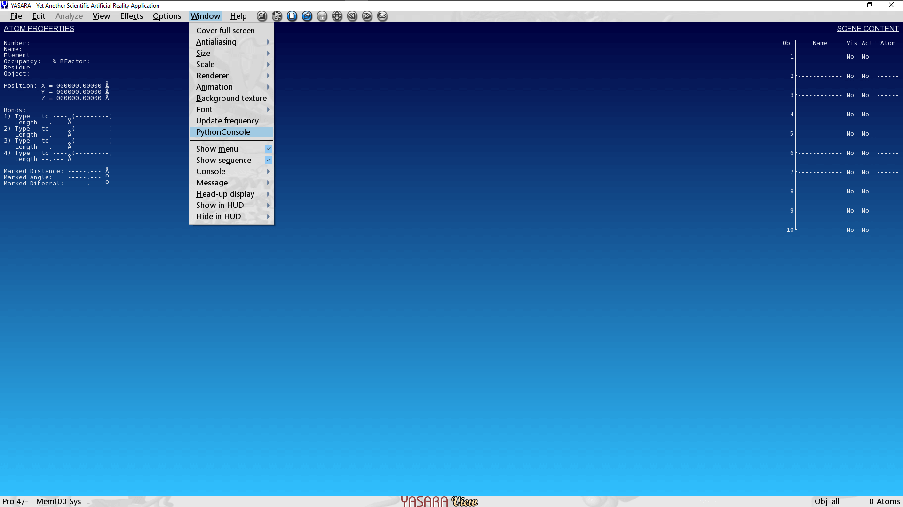

======================
Installing ``YaPyCon``
======================

.. _install_quickstart:

Quickstart
==========

Read this section if:

* You already have a working ``YASARA`` installation
* You already know what *"Python"* and *"virtual environment"* are 
  and you can start ``YASARA`` with a specific virtual environment activated first.
* You already know how ``YASARA`` plugins work and where to install them.

Installation
------------

1. Copy ``src/yapycon.py`` and ``src/yasara_kernel.py`` to ``<YASARA_HOME_DIRECTORY>/plg/``
   
   * This step does make ``YASARA`` aware of the plugin but for ``YaPyCon`` to work properly, it needs to operate within 
     a virtual environment that provides it with the necessary pre-requsites. This is achieved in the next steps.
     
2. Create a virtual environment and install ``requirements.txt``

3. Drop to a *terminal*, activate the environment and launch ``YASARA``

If everything has gone well, you will see a *"Python Console"* option added under the *"Window"* menu option:

Starting from scratch
=====================

A typical **full installation** process is divided into three parts:

Install ``YASARA`` 
------------------

* Go to `this URL <http://www.yasara.org/viewdl.htm>`_ to download ``YASARA`` View. This is the entry level 
 ``YASARA`` and freely available.
 
 * You will soon receive an email with a unique URL that leads to an approximately 1GB installer.
 
   * This installation process is identical for all versions of ``YASARA``.
   
* The installer is a self-extracting executable that will install ``YASARA`` in a ``yasara/`` directory right 
  in the *Current Working Directory*. This installation location is referenced throughout the documentation as 
  ``<YASARA_HOME_DIRECTORY>``.

* This installs the main piece of software but ``YASARA`` will attempt to pick up the *currently active* Python 
 interpreter. It is now important to ensure that the *"currently active"* Python interpreter has the necessary 
 pre-requisites installed. This is achieved in the following steps.
     

Install Python or virtual environment.
--------------------------------------

1. On **MS Windows:**, the quickest option would be to install some "flavour" of 
   `conda <https://docs.conda.io/en/latest/index.html>`_
   
2. On **Linux:**, the quickest option would be to use `virtualenv <https://wiki.python.org/moin/Virtualenv>`_

3. Create a virtual environment making sure that all the packages mentioned in ``requirements.txt`` are included.

   * ``YaPyCon`` requires ``PyQt5, IPython, qtconsole, Sphinx, rpyc``
   
4. Activate the virtual environment that has the pre-requisites installed.

   * See `this link <https://docs.conda.io/projects/conda/en/latest/user-guide/tasks/manage-environments.html>`_ for 
     ``conda`` or `this link <https://virtualenv.pypa.io/en/latest/index.html#>`_ for ``virtualenv``.
     

Install the ``YaPyCon`` plugin
------------------------------

If your system now includes a working ``YASARA`` installation with a properly prepared virtual environment, you are 
now ready to install and launch ``YaPyCon``.

The steps to do this are identical to the description in :ref:`install_quickstart`

